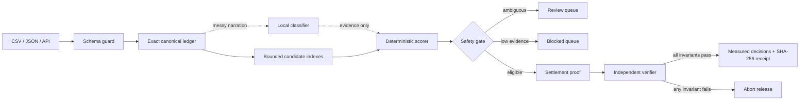

# ClosePilot architecture

## Design objective

Minimize false automatic matches, expose every unresolved record and keep AI away from irreversible financial authority. “Negligible errors” is treated as an engineering target measured per dataset—not a promise of universal zero error.

## Execution pipeline



1. **Schema guard** — validates stable IDs, ISO-style currency codes, exact amounts, source arrays, options and batch limits. Invalid rows become visible `validation` exceptions.
2. **Exact canonical ledger** — maps common Razorpay, bank and ledger aliases into currency- and merchant-scoped records backed by integer minor units (`bigint`).
3. **Narration model** — a measured local Naive Bayes classifier identifies settlement/refund/TDS/fee/payout intent from noisy bank text.
4. **Bounded candidate generation** — builds hash indexes for identifiers, UTRs, orders, customers, email and amount buckets. High-collision buckets are refused.
5. **Deterministic scoring** — evaluates direct references, UTRs, amount tolerance, date windows, customer identity, currency, merchant and record status.
6. **Safety gate** — requires an auto-match threshold and a minimum margin over the runner-up. Ambiguity routes to human review.
7. **Aggregate settlement proof** — groups Razorpay recon rows by `settlement_id` and proves `sum(credit - debit) == settlement amount`. A one-subunit difference fails the release gate.
8. **Independent verifier** — re-reads canonical match facts and checks one-to-one use, exact amount/currency/merchant safety, release thresholds, decision accounting and settlement proof.
9. **Evaluation** — optional ground truth produces precision, recall, F1 and false-auto-match rate.
10. **Verified release** — returns only after every invariant passes, with a deterministic run checksum and SHA-256 decision receipt.

## Complexity and scale

The engine never performs an `N × M` scan. Index construction is `O(n)` and each record queries a bounded number of candidate buckets. Candidate buckets above the configured collision limit are ignored unless reached through a strong identifier such as UTR or record ID.

The public evaluator runs synchronously for simple testing. A high-volume production topology would retain the same pure matching engine behind:

```text
Upload/API → Schema registry → Object storage → Durable queue
                                              ↓
                    shard(merchant, currency, close-window)
                                              ↓
              stateless reconciliation workers → audit store
                                              ↓
                        human review / idempotent outbox
```

- Shards are independent and horizontally scalable.
- Queue messages contain immutable object references and input checksums.
- Retries use the same idempotency key and cannot duplicate downstream work.
- Results are written through an outbox; a separate authorized service performs any posting.
- Backpressure, dead-letter queues and per-merchant concurrency limits isolate failures.

## Safety invariants

- Currency mismatch: hard reject.
- Merchant mismatch: hard reject.
- Bank debit presented as settlement credit: hard reject.
- Void/cancelled invoice: hard reject.
- Duplicate or missing stable ID: validation exception.
- Duplicate settlement entity evidence: every affected closure is withheld.
- Non-exact aggregate settlement net: human review; settlement-to-bank auto-match is withheld.
- Ambiguous top candidates: human review.
- Low evidence: blocked.
- Missing ground truth: accuracy metrics remain `null`.
- No source mutation or money movement inside the evaluator API.
- Every input becomes either a resolved record or a visible exception; silent drops must equal zero.
- Mixed-currency value totals are never combined into a misleading number.
- Any verifier failure aborts result release.

## AI boundary

AI is intentionally narrow. The narration classifier helps interpret unstructured text and contributes a small, non-authorizing signal. Identifiers, money values, dates, ownership scope, collision detection and posting eligibility remain deterministic. If the classifier is unavailable or uncertain, the core matcher continues and fails closed.

## Production observability

Recommended service-level indicators:

- false automatic match rate (primary safety SLI)
- precision/recall by merchant and source adapter
- review and blocked rates by reason
- p50/p95/p99 batch latency
- records/second and candidate-bucket collision rate
- schema rejection and silent-drop counts
- retry, dead-letter and idempotency-conflict counts

Any regression in false automatic matches should halt automatic posting before it affects money movement.
