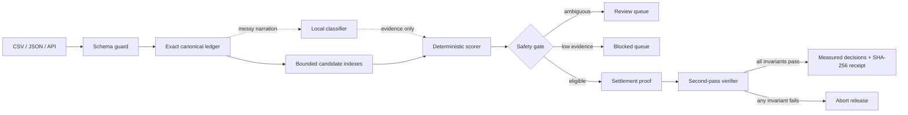

# ClosePilot architecture

This document describes the isolated 3.1 hardening branch. The submitted/live 3.0 deployment is unchanged. [Verified improvements and open production requirements](./HARDENING_REVIEW.md).

## Design objective

Minimize false automatic matches, expose every unresolved record and keep AI away from irreversible financial authority. “Negligible errors” is treated as an engineering target measured per dataset—not a promise of universal zero error.

## Execution pipeline



1. **Schema guard** — validates stable IDs, ISO-style currency codes, exact amounts, source arrays, options and batch limits. Invalid rows become visible `validation` exceptions.
2. **Exact canonical ledger** — maps common Razorpay, bank and ledger aliases into currency- and merchant-scoped records backed by integer minor units (`bigint`).
3. **Narration model** — a measured local Naive Bayes classifier identifies settlement/refund/TDS/fee/payout intent from noisy bank text.
4. **Bounded candidate generation** — builds hash indexes for identifiers, UTRs, orders, customers, email and amount buckets. High-collision buckets are refused.
5. **Deterministic scoring** — evaluates direct references, UTRs, amount tolerance, date windows, customer identity, currency, merchant and record status.
6. **Safety gate** — requires a minimum score and margin in both directions on the original candidate graph. Earlier assignments cannot make a later ambiguous candidate appear safe. Overflowed evidence withholds release.
7. **Aggregate settlement proof** — groups Razorpay recon rows by `settlement_id` and proves `sum(credit - debit) == settlement amount`. A one-subunit difference fails the release gate.
8. **Second-pass verifier** — re-reads match/exception facts, rebuilds candidate evidence and checks both-direction margins, one-to-one use, exact amount/currency/supplied merchant safety, record state, decision accounting and settlement proof. It shares canonicalization and scoring with the matcher; common-mode implementation errors remain possible.
9. **Evaluation** — optional ground truth produces precision, recall, F1 and false-auto-match rate.
10. **Verified release** — returns only after every invariant passes, with a deterministic run checksum and SHA-256 decision receipt.

## Complexity and scale

Index construction is `O(n)`. Each record queries a fixed number of buckets, each bounded by the configured limit B, including UTR and direct-ID buckets. Candidate ranking costs `O(n B log B)`, plus sorting for stable output/checksums. Overflow withholds auto-matching; it never silently certifies an incomplete graph. Only the top two forward and reverse contenders are retained after evaluation, bounding retained graph size by O(n). Common-price collisions can conservatively withhold otherwise plausible direct-ID matches.

SHA-256 uses UTF-8 byte storage, one reusable word buffer, and a maximum 128-byte padding tail. It does not expand every byte into a JavaScript number array. Dates share one Intl formatter. These remove large allocation multipliers, but canonical records, decisions, sorted checksum objects and JSON remain in memory. Summary responses do not make the synchronous engine streaming.

The public evaluator runs synchronously for simple testing. A high-volume production topology would retain the same pure matching engine behind:

```text
Upload/API → Schema registry → Object storage → Durable queue
                                              ↓
                    shard(merchant, currency, close-window)
                                              ↓
              stateless reconciliation workers → audit store
                                              ↓
                        human review / idempotent outbox
```

The queue/storage/outbox topology above is a **future design, not implemented infrastructure**:

- Partitioning must preserve candidate relationships, including records near window boundaries; arbitrary chunking is unsafe.
- Queue messages would contain immutable object references and input checksums.
- A durable idempotency store and transactional outbox would be required to prevent duplicate downstream work.
- A separately authorized posting service, backpressure, dead-letter queues and per-tenant concurrency limits would be required.

## Safety invariants

- Currency mismatch: hard reject.
- Merchant mismatch: hard reject.
- Bank debit presented as settlement credit: hard reject.
- Negative payment/invoice/settlement or contradictory bank credit/debit columns: withhold.
- Explicit failed, uncompleted or unknown payment/settlement state: withhold.
- Conflicting direct identifiers: hard reject.
- Void/cancelled invoice: hard reject.
- Duplicate or missing stable ID: validation exception.
- Duplicate settlement entity evidence: every affected closure is withheld.
- Non-exact aggregate settlement net: human review; settlement-to-bank auto-match is withheld.
- Ambiguous top candidates or competing sources for a destination: human review.
- Low evidence: blocked.
- Missing ground truth: accuracy metrics remain `null`.
- No source mutation or money movement inside the evaluator API.
- Every input becomes either a resolved record or a visible exception; silent drops must equal zero.
- Mixed-currency value totals are never combined into a misleading number.
- Any verifier failure aborts result release.

## AI boundary

AI is intentionally narrow: 36 training phrases and a 12-phrase synthetic holdout, with vocabulary-based abstention. It contributes at most three evidence points, not financial authority. The score is not a calibrated probability. Identifiers, money, supplied ownership scope, collision detection and eligibility remain deterministic. Missing ownership/state fields retain compatibility rather than proving authenticity. Dates contribute evidence rather than enforcing a universal invoice-age cutoff. This is an in-process classifier, not a remotely available model service with a tested outage failover.

## Production observability

Recommended service-level indicators:

- false automatic match rate (primary safety SLI)
- precision/recall by merchant and source adapter
- review and blocked rates by reason
- p50/p95/p99 batch latency
- records/second and candidate-bucket collision rate
- schema rejection and silent-drop counts
- retry, dead-letter and idempotency-conflict counts

Any regression in false automatic matches should halt automatic posting before it affects money movement.
