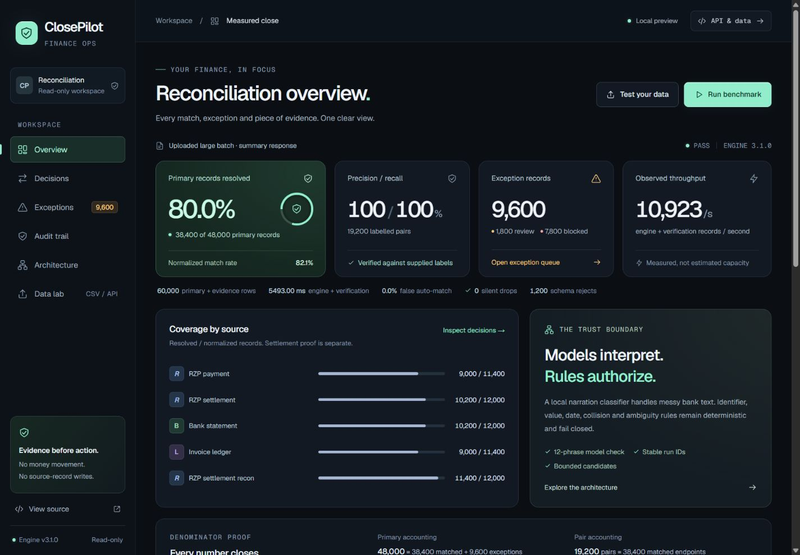
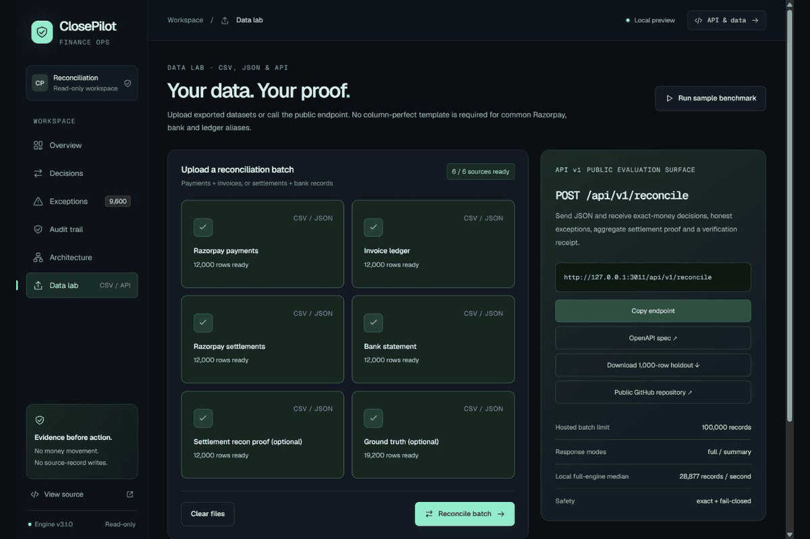
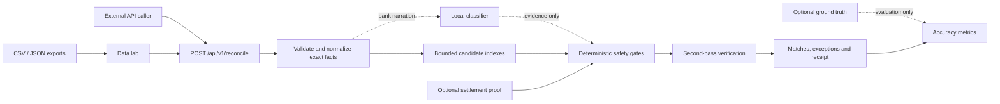

<div align="center">

# ClosePilot

### Models interpret. Rules authorize.

An evidence-first reconciliation workspace for payments, invoices, settlements and bank records.

[Open the workspace](https://closepilot-finance.vercel.app) · [API contract](https://closepilot-finance.vercel.app/openapi.json) · [Architecture](./ARCHITECTURE.md) · [Release checks](./UI_RELEASE_CHECKS.md)

</div>



ClosePilot turns exported CSV/JSON into exact-money matches, an honest exception queue, settlement-closure checks and reproducible verification receipts. Engine **3.1.0** strengthens two-way ambiguity checks, input validation and full-engine performance; the Midnight Ledger interface makes the evidence easier to inspect.

**This is a public, read-only evaluator—not a money-moving or multi-tenant production accounting service.** Use synthetic or non-confidential data. [Known boundaries](#production-boundaries) are part of the design, not fine print.

## See the workflow



*A stepped tour assembled from actual local UI captures—not a real-time execution recording. Static views: [Data lab](./docs/media/data-lab.png), [overview](./docs/media/overview.png), [decisions](./docs/media/decisions.png), [architecture](./docs/media/architecture.png).*

1. **Bring the records.** Open **Data lab** and select CSV/JSON files. Supply payments + invoices, settlements + bank transactions, or both.
2. **Add evidence when available.** Settlement recon items check the settlement net. Ground truth scores matching quality; it never authorizes a match.
3. **Run the batch.** The interface calls the same public versioned API evaluators can use directly. Selected files finish parsing before submission is enabled.
4. **Inspect the result.** Review primary-record coverage, labelled precision/recall, measurement source, source coverage and denominator accounting.
5. **Investigate exceptions.** Search records, filter by source and open the evidence drawer. Export returned decisions; large-run exports are explicitly marked as **samples**.
6. **Verify the run.** Audit trail exposes the verifier status and receipt. Architecture shows the six recorded execution stages.

## Start locally

Requires Node.js 22.13 or newer.

```bash
git clone https://github.com/souvikDevloper/closepilot.git
cd closepilot
npm ci
npm run dev -- --port 3000 --hostname 127.0.0.1
```

Open **http://127.0.0.1:3000**. No model API key, bank account or payment credentials are needed. For a built local server, run `npm run build`, then `npm run start -- --port 3000 --hostname 127.0.0.1`.

## Architecture at a glance



The verifier shares normalization/scoring code with the matcher: it is defense in depth, not an independently implemented oracle. No queue, database, posting service or authenticated bank connector is implied by this diagram. [Full architecture and invariants →](./ARCHITECTURE.md)

## Live evaluator deployment

- Public repository: https://github.com/souvikDevloper/closepilot
- App: https://closepilot-finance.vercel.app
- Evaluation API: https://closepilot-finance.vercel.app/api/v1/reconcile
- OpenAPI 3.1: https://closepilot-finance.vercel.app/openapi.json
- Health check: https://closepilot-finance.vercel.app/api/health

## Track 04 proof at a glance

| Required proof | ClosePilot evidence |
| --- | --- |
| One closed finance-ops loop | Payments are reconciled to invoices; aggregate settlement proof is reconciled to settlement totals; settlement credits are reconciled to bank transactions. |
| A batch larger than 50 records | The labelled judge path contains 1,000 primary records. The committed scale run contains 100,000 primary records plus 32,500 proof rows. |
| Measured accuracy | The labelled holdout reports 100% precision and recall, with the denominator and pair/end-point arithmetic shown below. Unlabelled runs report accuracy as `null`. |
| Measured throughput | The 3.1 full-engine 132,500-row local benchmark measured a 4.59-second median across three isolated runs (~28,877 rows/second), including verification and receipt construction. This is not a hosted capacity guarantee. |
| Honest exceptions | The 1,000-record holdout resolves 960 endpoints and returns 40 exceptions: 10 review and 30 blocked. |
| Judge-testable delivery | Public source, a one-command local evaluation, downloadable holdout data, OpenAPI 3.1 and a public versioned API are all available above. |

## What is real

- The UI calls the same versioned `POST /api/v1/reconcile` endpoint available to evaluators.
- Batch outcomes come from the real engine. Timing explicitly distinguishes complete-engine duration, browser round trip and a documented local reference benchmark.
- Money is parsed and summed as exact integer minor units; floating-point values never authorize a decision.
- Razorpay settlement credits and debits are aggregated by settlement and must close exactly before bank matching is released.
- Candidate generation uses bounded indexes instead of a Cartesian scan.
- Currency, merchant scope, bank direction, duplicate IDs, void invoices, confidence and ambiguity are hard safety gates.
- A local Naive Bayes model classifies messy bank narrations. It can provide evidence but cannot authorize a financial decision.
- A separate verification pass rebuilds candidate evidence and checks both-direction ambiguity, match and exception facts, one-to-one use, settlement proof and decision accounting. It shares normalization/scoring code with the matcher, so it is defense in depth, not a completely independent implementation. The SHA-256 receipt is a reproducibility hash, not an authenticated digital signature.
- The API does not move money or modify source systems.

## Models interpret; rules authorize

The narration model is deliberately small, local and inspectable: 36 training phrases and a separate 12-phrase synthetic holdout. It uses Laplace-smoothed multinomial Naive Bayes for settlement, refund, TDS, fee, payout and unknown. It abstains when vocabulary coverage is insufficient. The holdout is a smoke check, not evidence of generalization to unseen banks; its percentage must not be confused with reconciliation precision.

For settlement-to-bank matching, model output is worth only **3 evidence points** and is counted only when `settlement` confidence is at least 45%. Deterministic evidence carries authority:

- exact UTR: +70
- settlement reference in the bank feed: +55
- exact net amount in integer minor units: +25
- settlement-window evidence: up to +10
- narration model: at most +3

Automatic release requires at least 85 evidence points (not a probability), an exact positive amount, and a 10-point lead in both source-to-destination and destination-to-source competition. All candidate buckets, including UTRs and direct identifiers, are bounded. Incomplete collision evidence withholds release. Currency/supplied merchant mismatch, conflicting direct identifiers, failed or uncompleted payment/settlement states, and bank debits cannot be outscored. Tolerated amount differences remain review-only. Missing status/merchant fields retain legacy export compatibility; that is not proof of source authenticity or tenant isolation. Dates contribute evidence, rather than imposing a universal invoice-age cutoff.

Illustrative decision trace:

```text
Bank text:   "RZP merchant settlement UTR-AX91 credited"
Model:       settlement -> up to +3 evidence points
Rules:       exact UTR +70; exact net amount +25; date window up to +10
Authority:   release only if hard gates, threshold and ambiguity checks pass
Countercase: the same text with a debit, wrong currency, wrong merchant or
             non-exact amount is rejected or routed to review
```

The model therefore helps interpret an unstructured field but cannot manufacture identity, repair money or overrule a safety boundary.

## Reproducible benchmark

```bash
npm ci
npm run lint
npm run typecheck
npm test
npm run eval:holdout
npm run benchmark -- 100
npm run eval:meridian
node --experimental-strip-types scripts/compare-engine.ts
```

`npm run eval:holdout` is the one-command judge path. It produces 1,000 primary records plus 325 Razorpay settlement evidence rows: 480 labelled pairs and 40 deliberately ambiguous or unmatched primary records. The arithmetic is `1,000 primary = 960 matched endpoints + 40 exceptions`; the 480 pair decisions each resolve two endpoints, and the 325 evidence rows are excluded from the match-rate denominator.

The automated suite also processes a 10,000-primary-record variant and verifies exact money, deterministic receipts, aggregate settlement proof, one-subunit tampering, ambiguity, malformed inputs, duplicate evidence, cross-currency candidates, cross-merchant candidates and bank debits.

Hardened 3.1 local run with 100,000 primary records plus 32,500 settlement evidence rows on the development machine:

- 48,000 matched pairs
- 4,000 honest exception records
- 100% precision and recall on the generated labelled holdout
- 0 false automatic matches
- 0 silent drops
- ~28,877 primary + evidence records/second, median 4.59 seconds for the complete engine

Performance is hardware-dependent. These figures describe the committed synthetic benchmark, not all external data. The 132,500-row run is a local CLI stress test above the hosted API's 100,000-record guard. Whole Node-process peak RSS was approximately 456 MiB; this is not a validated 128 MiB edge-worker workload. See [full timing methodology and production blockers](./HARDENING_REVIEW.md).

The fresh Meridian fixture exercises 48,000 primary rows plus 12,000 settlement proof rows, with independently specified labels: 19,200 pairs, 9,600 exceptions, 80% input resolution, and 100% pair precision/recall on this synthetic fixture. Ground truth changes evaluation only. Withholding settlement proof is a different evidence condition and has a separate expected label set.

Generate the six Data lab upload files with:

```bash
node --experimental-strip-types scripts/evaluate-meridian.ts 12000 --export
```

Upload each file from `outputs/meridian/` to its named Data lab source. Ground truth and settlement proof are optional. Rejects remain in primary accounting. CSV imports reject malformed rows, duplicate headers and invalid labels; large summary exports are clearly marked as samples, not full audit downloads.

The dashboard preserves that distinction. If the edge runtime cannot provide a trustworthy monotonic duration, the API returns `null`; the UI then shows the documented local benchmark, or a browser-observed end-to-end rate after an interactive run, with the measurement source labelled.

## Public evaluation API

```bash
curl -X POST https://closepilot-finance.vercel.app/api/v1/reconcile \
  -H "Content-Type: application/json" \
  -H "Idempotency-Key: evaluator-run-001" \
  -d @examples/request.json
```

Useful endpoints:

- `GET /api/v1/reconcile` — contract, limits and example
- `POST /api/v1/reconcile` — execute a batch
- `POST /api/reconcile` — deprecated compatibility alias
- `GET /api/benchmark?scale=1` — download the labelled 1,000-record holdout
- `GET /openapi.json` — OpenAPI description
- `GET /api/health` — health and engine version

The API admission guards accept up to 100,000 primary-plus-proof records in `summary` mode, with a streamed 20 MiB body limit. Full responses are capped at 20,000 records. Summary mode bounds the returned collections, not the computation's memory. These limits are guards, not promises of latency, concurrency or edge-memory capacity. Oversized production workloads need durable jobs and boundary-aware partitioning that preserves all candidate relationships.

`Idempotency-Key` labels a deterministic run; it does **not** provide a durable replay cache, changed-payload conflict store, exactly-once processing or posting. A deployment may configure `CLOSEPILOT_API_KEY` for a shared API key, but tenant RBAC, durable audit storage, rate limiting and authenticated source connectors are not implemented. Do not upload confidential live financial records to the public demonstration service.

## Request contract

```json
{
  "payments": [],
  "invoices": [],
  "settlements": [],
  "bank_transactions": [],
  "settlement_recon_items": [],
  "ground_truth": [{ "left_id": "pay_001", "right_id": "inv_001" }],
  "response_mode": "full"
}
```

Ground truth is optional. When supplied, the response calculates precision, recall, F1 and false-auto-match rate. Without it, those metrics are returned as `null` instead of being invented.

The response exposes two deliberately different coverage denominators: `input_resolution_rate` is matched endpoints divided by every submitted primary record (including validation rejects), while the backward-compatible `match_rate` is matched endpoints divided by successfully normalized records. Runtime and throughput are `null` when the host's monotonic clock is too coarse to support an honest measurement.

`settlement_recon_items` accepts Razorpay settlement recon rows. `credit`, `debit`, `fee` and `tax` are integer currency subunits. Fees and tax are evidence fields; the authoritative settlement net is `sum(credit - debit)`, so they are not subtracted twice.

For multi-currency batches, `value_reconciled` is deliberately `null`; exact totals are returned separately in `value_reconciled_by_currency`.

## Production boundaries

The current implementation has no durable job/replay store, tenant RBAC, audit database, source authentication, downstream posting or tested hosted concurrency SLA. Summary mode bounds response size, **not** all computation memory. Pairwise matching does not implement split-payment allocation, FX conversion or a refund ledger. The classifier's 12-phrase check is not evidence of unseen-bank generalization.

The published record limit is an admission guard, not a throughput promise. Large production workloads require boundary-aware partitioning, durable jobs and separately authorized posting. See [hardening evidence and remaining requirements](./HARDENING_REVIEW.md).

## Repository guide

| Area | Purpose |
| --- | --- |
| `app/closepilot-client.tsx` + `app/globals.css` | All six workspace views, uploads, real request state and accessible evidence dialog |
| `app/api/v1/reconcile/` | Versioned reconciliation API and input guards |
| `lib/reconciliation.ts` | Exact-money matching, safety policy, metrics and verification |
| `lib/data-lab.ts` | Strict CSV/JSON import, request assembly and safe CSV cells |
| `tests/` | Engine, API, Data lab and adversarial fixture regression tests |
| `scripts/` | Holdout, scale and Meridian evaluations |
| `envelope/vercel.json` | Stable public Vercel address forwarding to the existing hosting origin |
| `docs/media/` | Real UI images and animated walkthrough |

## Release and URL continuity

The public entry point remains **https://closepilot-finance.vercel.app**. Vercel serves as an envelope for the existing hosting origin; the address, forwarding configuration and API path stay unchanged. Publishing updates the existing origin, not the user's bookmark. [UI and release checks](./UI_RELEASE_CHECKS.md) distinguish automated tests, browser verification and hosted limitations.

## Submission artifacts

- [Five-minute pitch](./VIDEO_PITCH.md) — a timed, word-for-word recording script with exact screen actions and the complete 2 AM incident.
- [Architecture](./ARCHITECTURE.md) — safety boundaries, execution flow, invariants and production scale-out design.
- [Release evidence](./RELEASE_EVIDENCE.md) — reproducible quality gates and independent stress-test receipts.

The pitch is designed to show the engine running, inspect one messy narration decision, explain why the model cannot authorize money, and answer what broke at 2 AM with symptom, risk, diagnosis, fix and verification.
